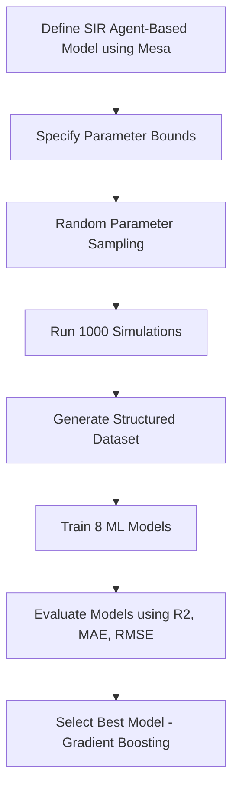

# Data Generation using Modelling and Simulation for Machine Learning

## Simulation Tool Used
Mesa (Agent-Based Modeling Framework in Python)

Mesa is a discrete-event multi-agent simulation framework used to model complex systems.

---
## Exploration of Mesa

Mesa provides:
- Agent class for defining individual behavior
- Model class for system-level structure
- Grid space for agent interaction
- RandomActivation scheduler
- DataCollector for recording simulation metrics

These components were explored to design the epidemic simulation model.

## Problem Statement

An epidemic spread simulation (SIR Model) was implemented using Mesa. The goal was to generate synthetic simulation data and train machine learning models to predict epidemic peak intensity.

---

## Simulation Model Description

We implemented an agent-based SIR model:

- S: Susceptible
- I: Infected
- R: Recovered

Agents interact on a grid and spread infection probabilistically.

---

## Parameters and Bounds

| Parameter | Lower Bound | Upper Bound |
|-----------|-------------|-------------|
| Infection Probability | 0.05 | 0.5 |
| Recovery Probability | 0.01 | 0.3 |
| Population | 100 | 400 |
| Initial Infected | 1 | 20 |

---

## Data Generation

- 1000 independent simulations were executed.
- Each simulation ran for 50 time steps.
- For each run, the following outputs were recorded:
  - Peak Infected
  - Total Infected

The dataset consists of 1000 samples generated via simulation.

---

## Machine Learning Task

Target Variable:
- Peak Infected

Input Features:
- Infection Probability
- Recovery Probability
- Population
- Initial Infected

---

## Models Compared

1. Linear Regression  
2. Ridge  
3. Lasso  
4. Random Forest  
5. Gradient Boosting  
6. SVR  
7. KNN  
8. XGBoost  

---

## Evaluation Metrics

- R² Score
- MAE (Mean Absolute Error)
- RMSE (Root Mean Square Error)

---

## Results

Gradient Boosting achieved the best performance with:

- Highest R² score
- Lowest RMSE

This indicates strong nonlinear modeling capability for epidemic dynamics.

---

## Methodology Workflow

1. Define epidemic agent-based model in Mesa
2. Specify parameter bounds
3. Randomly sample parameters
4. Run 1000 simulations
5. Construct dataset
6. Train 8 ML models
7. Compare performance metrics
8. Select best model

---

## Workflow Diagram



## Conclusion

This project demonstrates how simulation-based data generation can be integrated with machine learning for predictive modeling. Gradient Boosting performed best for modeling epidemic peak dynamics.

---

## How to Run

```
pip install mesa scikit-learn xgboost matplotlib seaborn
```

Run the notebook in Google Colab.
